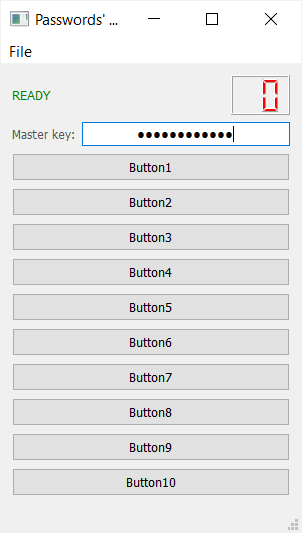
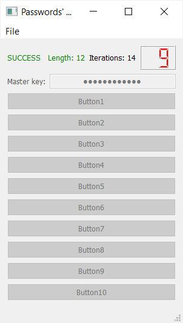

# Passwords manager with GUI (Python, Qt)
The program uses a well-known principle: passwords are not stored anywhere, to generate all passwords, one master password is used, which is entered by the user.

After starting the program in the menu "File" -> "Open File" you need to select a file with logins.
After selecting a file, the program displays buttons corresponding to individual services.
When you click on any button, the corresponding login is copied to the clipboard and a window appears with the message: "Please copy login now". When you click on the "OK" button in the message window, a password is generated and copied to the clipboard.

File with logins has the following format:
name_on_button_1;login_1;name_of service_or_site_1
name_on_button_2;login_2;name_of service_or_site_2
name_on_button_3;login_3;name_of service_or_site_3

Password generation principle:
1) the master password, login and name of the service (website) are combined together into a string;
2) SHA512 conversion is performed on this line;
3) letters, numbers and special characters are selected from the resulting byte sequence, which form a new string;
4) if this new string meets the password requirements (length, presence of certain characters), then it becomes the password. Otherwise, the cycle of conversions is repeated over the new string.

          
